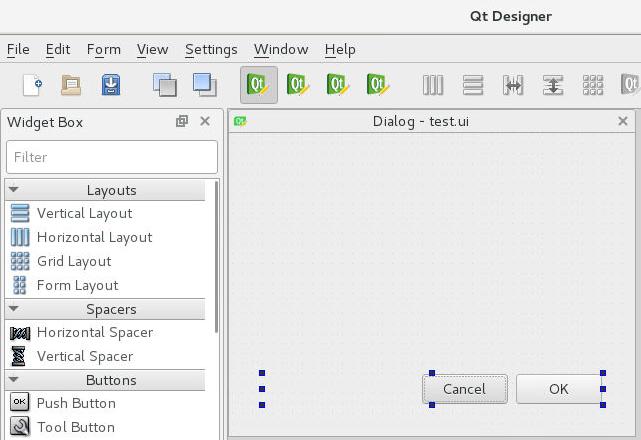

# QT Designer 를 이용한 인터페이스 제작
코드로 인터페이스를 제작하는 것은 효율성이 떨어집니다.
QT Designer를 이용해서 .ui를 만들고 Python 코드에서 로드하여 사용하는 방법을 알아보겠습니다.
인하우스 툴을 제작할 때 많이 사용하는 방법입니다.

QT Designer에서 기본 Dialog 양식으로 파일을 시작합니다.



test.ui로 파일을 저장해주세요. 

같은 경로에 아래처럼 파이썬 예제를 작성해주세요.

```python
import sys  
from PySide2.QtUiTools import *
from PySide2.QtWidgets import *
from PySide2.QtCore import *

class MyWidget(QObject):
    def __init__(self, ui_file, parents=None):
        ui_file = QFile(ui_file)
        ui_file.open(QFile.ReadOnly)
        loader = QUiLoader()
        self.window = loader.load(ui_file)
        ui_file.close()
        btn = self.window.findChild(QDialogButtonBox,"buttonBox")
        btn.accepted.connect(self.accepted_handler)
        btn.rejected.connect(self.rejected_handler)

        self.window.show()
			
    def accepted_handler(self):
        print("accepted")

    def rejected_handler(self):
        print("rejected")
		

if __name__ == '__main__':  
    app = QApplication(sys.argv)
    form = MyWidget("test.ui")
    sys.exit(app.exec_())
```

이런 형태로 코드를 작성하면 Gui는 Qt Designer에서 프로그래밍 로직은 파이썬에 작성할 수 있습니다.

#### Reference
https://stackoverflow.com/questions/4442286/python-code-generation-with-pyside-uic