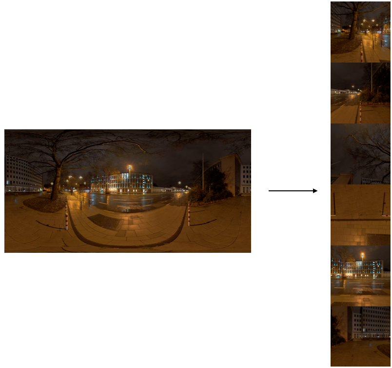

# OpenEXR 명령어
OpenEXR을 컴파일하면 bin 폴더에 아래 명령어들이 생성됩니다.
exr을 제어하는 명령어들은 필요할 때 파이프라인에 활용할 수 있습니다.

## exrenvmap


latitude-longitude맵을 Cube환경맵으로 바꿀 때 사용합니다. Six팩이라고도 불립니다.

```bash
$ exrenvmap input.exr output.exr
```

## exrmakepreview
.exr 프리뷰파일을 생성합니다.

```bash
$ exrmakepreview -w 150 input.exr output.exr
```

## exrmultipart
멀티파트 exr이미지를 분리할 때 사용합니다.

```bash
$ exrmultipart -separate -i sample-multipart.exr -o sample
```

아웃풋:
```
numOutputs: 2
outputfilename: sample.1.exr
outputfilename: sample.2.exr
scanlineimage
scanlineimage

Seperate Success
```

싱글파트 exr을 멀티파트 exr로 변경할 때 사용합니다.

```bash
$ exrmultipart -convert -i infile.exr -view left -o outfile.exr
```
## exrstdattr
exr 파일 내부에 설정된 값을 변경, 사용자 값을 추가할 때 사용합니다.
옵션이 많습니다. 필요시 -h 옵션을 이용해서 값을 변경할 수 있습니다.

```bash
$ exrstdattr -string project circle input.exr output.exr
```

여러값을 넣을 수 있습니다.

```bash
$ exrstdattr -string project circle -string shot FOO_0010 input.exr output.exr
```

exrheader 명령어로 확인하면 type string 값을 확인할 수 있습니다.
```
project (type string): "circle"
```
- ref : http://manpages.ubuntu.com/manpages/xenial/man1/exrstdattr.1.html

## exrheader
.exr 파일 헤더를 읽어서 출력합니다.

```bash
$ exrheader night_city.exr 
```

아웃풋:
```
file night_city.exr:

file format version: 2, flags 0x0
channels (type chlist):
    B, 16-bit floating-point, sampling 1 1
    G, 16-bit floating-point, sampling 1 1
    R, 16-bit floating-point, sampling 1 1
compression (type compression): zip, individual scanlines
dataWindow (type box2i): (0 0) - (4095 2047)
displayWindow (type box2i): (0 0) - (4095 2047)
lineOrder (type lineOrder): increasing y
nuke/full_layer_names (type int): 0
nuke/node_hash (type string): "1d15cdf91144c78c"
nuke/version (type string): "11.1v4"
pixelAspectRatio (type float): 1
screenWindowCenter (type v2f): (0 0)
screenWindowWidth (type float): 1
type (type string): "scanlineimage"
version (type int): 1
```


## exrmaketiled
tiled 이미지를 생성할 때 사용합니다.

[mipmap](https://ko.wikipedia.org/wiki/밉맵) : 렌더링 속도를 향상시키기 위해서 만들어진 솔루션. 연속적으로 축소시킨 이미지

```bash
$ exrmaketiled -m -v checkbox.exr checkbox_tiled.exr
```

[ripmap](http://kaba.hilvi.org/pastel-1.3.0/pastel/gfx/ripmap.htm) : 다운샘플링된 이미지의 집합입니다. LOD(Level Of Detail)에 사용합니다.

```bash
$ exrmaketiled -r -v checkbox.exr checkbox_tiled.exr
```

## exrmultiview
여러 exr파일을 묶어서 하나의 멀티파트 이미지로 생성합니다.
입체, 360도 이미지등을 묶을 수 있습니다.

```bash
$ exrmultivew left imgL.exr right imgR.exr imgLR.exr
```

위처럼 생성된 EXR이미지는 아래처럼 exrmultipart 명령어를 이용해서 나눌수 있습니다.


convert는 항상 싱글파트 exr을 멀티파트 exr로 바꿀때만 사용가능합니다.

```
exrmultipart -convert -i left.exr -view left -o left_multipart.exr
```

exrheader, 뉴크에서 메타데이터를 확인하면 view 값이 설정되어있는 것을 확인할 수 있습니다.

- ref : https://openexr-devel.nongnu.narkive.com/q1Cos7DF/multipart-backward-compatibility

## 실습
명령어에 -h 옵션을 붙히면 수많은 옵션들이 출력됩니다.
궁금한 옵션들을 실습 하면서 실제 이미지가 어떻게 변하는지 체크해보세요.

## 응용
- 멀티파트 exr 파일처럼 하나의 .exr파일에 수많은 이미지를 저장할 수 있습니다. 파일 하나로 관련된 라이브러리 구축
	- 모니터화면 합성시 멀티파트 라이브러리 사용
	- 터미널을 이용한 exr 입체영상 파이프라인 구축
	- 터미널을 이용한 exr 360도(6면영상) 파이프라인 구축
- .exr 파일에는 int, float, string 값을 저장할 수 있습니다. 사용자 정보를 적용하여 어떻게 하면 효율적인 파이프라인을 구성할 수 있을지 고민해보세요.