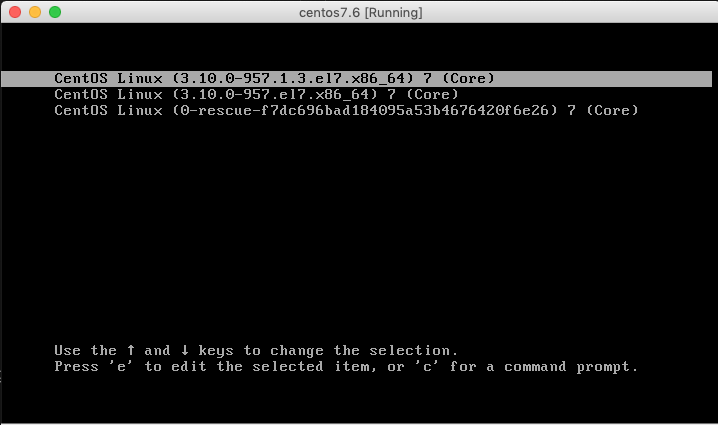
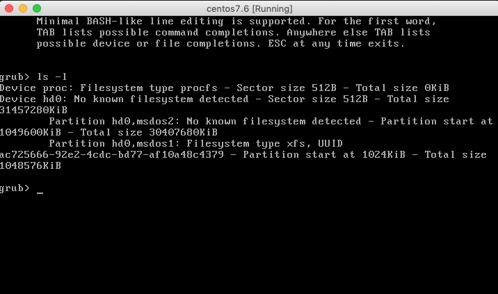

# 부팅메뉴 설정 Grub2
강의실은 리눅스 뿐만 아니라 윈도우즈로 수업하는 강의도 있습니다.
컴퓨터 부팅시 Windows, Linux를 선택하여 부팅할 수 있도록 해야합니다.
이번 시간은 그 과정으로 Grub을 셋팅하는 방법을 다루겠습니다.

아래 그림처럼 말이죠!!


우리가 사용하는 방법뿐만 아니라 Grub을 사용하면 여러 OS를 설치 선택할 수 있습니다.

## 설정


부팅메뉴 창에서 c 키를 눌러줍니다.



파티션 정보가 출력됩니다.
```
grub> ls -l
```

출력되는 정보를 통해서 윈도우즈가 설치된 하드디스크 정보를 분석합니다. ntfs, 1024KB 라고 적힌 부분을 찾아서 읽습니다.

우리가 찾아야 할 패턴은 `hd1,msdos1` 형태의 문자열입니다.
이 강의실에서는 윈도우즈 10이 설치된 하드디스크가 보통 이 문자열을 띄지만 자리마다 다를 수 있으니 참고바랍니다. 이 문자를 기억하거나 기록해두세요.

grub을 나가는 단축키는 `ESC` 키 입니다.

CentOS7로 부팅합니다.

관리자로 전환하여 아래 명령어를 입력해주세요.
```
$ su
# vim /boot/grub2/grub.cfg
```

맨 아랫줄에 다음 내용을 추가합니다.
```
# windows10
menuentry 'Windows10' {
    insmod ntfs
    set root=(hd1,msdos1)
    chainloader +1
}
```


부팅하면 Windows10 메뉴가 생성됩니다.

Windows10 메뉴에 들어가서 리눅스 및 윈도우즈로 잘 부팅되는지 체크해주세요.
